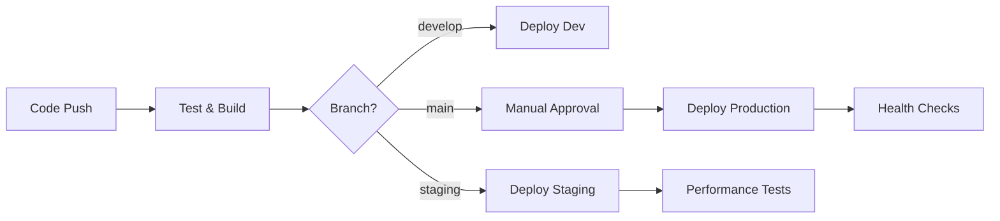

# 🌍 Khoded Multi-Environment Setup Guide

**Complete guide for development, staging, and production environments**

## 📋 Overview

The Khoded project uses a three-tier environment setup with corresponding Git branching strategy:

| Environment | Branch | Purpose | Auto-Deploy | URL |
|-------------|--------|---------|-------------|-----|
| **Development** | `develop` | Local development & testing | ✅ Yes | http://localhost:8080 |
| **Staging** | `staging` | Pre-production testing | ✅ Yes | https://staging.khoded.com |
| **Production** | `main` | Live production site | 🟡 Manual approval | https://khoded.com |

---

## 🏗️ Architecture Overview

```
┌─────────────────┐    ┌─────────────────┐    ┌─────────────────┐
│   DEVELOPMENT   │    │     STAGING     │    │   PRODUCTION    │
│                 │    │                 │    │                 │
│ • Local Docker  │    │ • Full Stack    │    │ • Zero Downtime │
│ • Hot Reload    │    │ • SSL Enabled   │    │ • Monitoring    │
│ • Debug Mode    │    │ • Monitoring    │    │ • Backup        │
│ • Test Data     │    │ • Load Testing  │    │ • CDN           │
└─────────────────┘    └─────────────────┘    └─────────────────┘
         │                       │                       │
         ▼                       ▼                       ▼
   develop branch          staging branch            main branch
```

---

## 🚀 Quick Start

### 1. Development Environment

```bash
# Switch to develop branch
git checkout develop

# Deploy development environment
./scripts/deploy-dev.sh

# Access the application
open http://localhost:8080
```

### 2. Staging Environment

```bash
# Switch to staging branch  
git checkout staging

# Deploy staging environment
./scripts/deploy-staging.sh

# Access the application
open https://staging.khoded.com
```

### 3. Production Environment

```bash
# Switch to main branch
git checkout main

# Deploy production environment (requires confirmation)
./scripts/deploy-production.sh

# Access the application
open https://khoded.com
```

---

## 📁 File Structure

```
khoded-project/
├── .env.development          # Development environment variables
├── .env.staging             # Staging environment variables  
├── .env.production          # Production environment variables
├── docker-compose.dev.yml   # Development Docker setup
├── docker-compose.staging.yml # Staging Docker setup
├── docker-compose.prod.yml  # Production Docker setup
├── scripts/
│   ├── deploy-dev.sh        # Development deployment
│   ├── deploy-staging.sh    # Staging deployment  
│   └── deploy-production.sh # Production deployment
├── .github/workflows/
│   └── ci-cd.yml           # CI/CD pipeline
└── secrets/                 # Environment secrets (gitignored)
```

---

## 🔧 Environment Configurations

### Development Environment

**Purpose**: Local development and testing  
**Configuration**: `.env.development`  
**Docker Compose**: `docker-compose.dev.yml`  

**Features**:
- ✅ Hot reload enabled
- ✅ Debug logging  
- ✅ Mock email service (MailCatcher)
- ✅ Relaxed security settings
- ✅ In-memory database option
- ✅ Development tools (Grafana, Prometheus)

**Services**:
- Application (port 8080)
- PostgreSQL database (port 5432)  
- Redis cache (port 6379)
- MailCatcher (port 1080)
- Grafana (port 3000)
- Prometheus (port 9090)

### Staging Environment

**Purpose**: Pre-production testing and validation  
**Configuration**: `.env.staging`  
**Docker Compose**: `docker-compose.staging.yml`  

**Features**:
- ✅ Production-like setup
- ✅ SSL certificates  
- ✅ Full monitoring stack
- ✅ Automated backups
- ✅ Load testing capabilities
- ✅ Performance monitoring

**Services**:
- Application (behind nginx proxy)
- PostgreSQL database  
- Redis cache
- Nginx (SSL termination)
- Prometheus + Grafana
- Loki + Promtail (logging)
- Automated backup service

### Production Environment

**Purpose**: Live production website  
**Configuration**: `.env.production`  
**Docker Compose**: `docker-compose.prod.yml`  

**Features**:
- ✅ Zero-downtime deployments
- ✅ SSL/HTTPS enforced
- ✅ Comprehensive monitoring  
- ✅ Automated backups
- ✅ CDN integration
- ✅ Security hardening
- ✅ Performance optimization

**Services**:
- Application (multiple instances)
- PostgreSQL database (with replication)
- Redis cluster
- Nginx (load balancer + SSL)
- Full monitoring stack
- Log aggregation
- Backup services

---

## 🌿 Git Branching Strategy

### Branch Structure

```
main (production)
├── staging (pre-production)
│   └── develop (development)
│       ├── feature/feature-name
│       ├── bugfix/bug-description  
│       └── hotfix/critical-fix
└── hotfix/production-fix (direct to main)
```

### Workflow

1. **Feature Development**:
   ```bash
   git checkout develop
   git checkout -b feature/new-feature
   # Develop feature
   git push origin feature/new-feature
   # Create PR to develop
   ```

2. **Staging Release**:
   ```bash
   git checkout staging
   git merge develop
   git push origin staging
   # Auto-deploys to staging
   ```

3. **Production Release**:
   ```bash
   git checkout main
   git merge staging  
   git push origin main
   # Deploys to production (with approval)
   ```

### Branch Protection Rules

| Branch | Protection Rules |
|--------|-----------------|
| `main` | • Require PR reviews (2+)<br>• Require status checks<br>• Require up-to-date branches<br>• Restrict push access |
| `staging` | • Require PR reviews (1+)<br>• Require status checks<br>• Allow fast-forward merges |
| `develop` | • Require status checks<br>• Allow direct pushes for maintainers |

---

## 🤖 CI/CD Pipeline

### Pipeline Stages



### Automated Actions

| Trigger | Action | Environment |
|---------|--------|-------------|
| Push to `develop` | Auto-deploy | Development |
| Push to `staging` | Auto-deploy + performance tests | Staging |
| Push to `main` | Manual approval → deploy | Production |
| PR to any branch | Run tests + security scan | CI |

### GitHub Secrets Required

```bash
# Production secrets (configure in GitHub repository settings)
PRODUCTION_DB_PASSWORD
PRODUCTION_GMAIL_SERVICE_ACCOUNT  
DOCKER_REGISTRY_TOKEN
SLACK_WEBHOOK_URL
```

---

## 🔐 Security Configuration

### Secret Management

**Development**:
- Local secrets in `secrets/` directory
- Dummy credentials for testing
- No external services required

**Staging**:
- Docker secrets mounted from files
- Separate staging service accounts
- SSL with staging certificates

**Production**:
- Encrypted Docker secrets
- Production service accounts  
- Commercial SSL certificates
- Security scanning enabled

### Access Control

| Environment | Access Level | Authentication |
|-------------|--------------|----------------|
| Development | Open | None |
| Staging | Team only | VPN/IP restrictions |
| Production | Restricted | Multi-factor auth |

---

## 📊 Monitoring & Observability

### Development

**Basic monitoring**:
- Application logs via Docker
- Basic Prometheus metrics
- Grafana dashboard (admin/admin)

**Access**:
- Grafana: http://localhost:3000
- Prometheus: http://localhost:9090

### Staging

**Production-like monitoring**:
- Full Prometheus + Grafana stack
- Log aggregation with Loki
- Performance monitoring
- Alerting configuration

**Access**:
- Grafana: https://staging.khoded.com:3000
- Prometheus: https://staging.khoded.com:9090

### Production

**Comprehensive monitoring**:
- Multi-instance Prometheus
- High-availability Grafana
- Log aggregation and analysis
- Real-time alerting
- Performance optimization

**Access**:
- Grafana: https://khoded.com:3000
- Prometheus: https://khoded.com:9090

---

## 🗄️ Database Management

### Development

```bash
# Local PostgreSQL container
Database: khodedBackendData
User: admin
Password: khodedData
Host: localhost:5432

# Database operations
docker-compose -f docker-compose.dev.yml exec database psql -U admin -d khodedBackendData
```

### Staging

```bash
# Staging database with backups
Database: khoded_staging
User: khoded_staging_user  
Password: (from secrets)

# Manual backup
./scripts/backup-staging.sh
```

### Production

```bash  
# Production database with replication
Database: khoded_production
User: khoded_user
Password: (from secrets)

# Automated backups (daily)
# Manual backup: ./scripts/backup-production.sh
```

---

## 🚨 Troubleshooting

### Common Issues

**Development not starting**:
```bash
# Check Docker status
docker info

# Reset development environment  
docker-compose -f docker-compose.dev.yml down -v
./scripts/deploy-dev.sh
```

**Staging deployment fails**:
```bash
# Check branch and working directory
git status
git checkout staging
git pull origin staging

# Check staging secrets
ls -la secrets/staging_*

# Re-deploy
./scripts/deploy-staging.sh
```

**Production health checks fail**:
```bash
# Check application health
curl -sf https://khoded.com/health

# Check container status
docker-compose -f docker-compose.prod.yml ps

# Check logs
docker-compose -f docker-compose.prod.yml logs app
```

### Log Access

**Development**:
```bash
# Application logs
docker-compose -f docker-compose.dev.yml logs -f app

# Database logs  
docker-compose -f docker-compose.dev.yml logs -f database
```

**Staging/Production**:
```bash
# Application logs
docker-compose -f docker-compose.[staging|prod].yml logs -f app

# System logs
journalctl -u docker -f

# Grafana logs dashboard
# Access via Grafana UI
```

---

## 📞 Support

### Environment Issues

**Development**: Check local Docker setup and port conflicts  
**Staging**: Verify staging secrets and SSL certificates  
**Production**: Contact DevOps team for production issues  

### Deployment Pipeline  

**CI/CD Issues**: Check GitHub Actions logs and repository secrets  
**Branch Issues**: Verify branch protection rules and PR requirements  
**Secrets Issues**: Validate secret files and permissions  

### Monitoring

**Metrics Missing**: Check Prometheus targets and service discovery  
**Alerts Not Working**: Verify AlertManager configuration  
**Dashboard Issues**: Check Grafana data sources and queries  

---

## 📚 Additional Resources

- [Docker Compose Documentation](https://docs.docker.com/compose/)
- [GitHub Actions Documentation](https://docs.github.com/actions)
- [Prometheus Documentation](https://prometheus.io/docs/)
- [Grafana Documentation](https://grafana.com/docs/)

---

**Last Updated**: 2025-08-18  
**Version**: 1.0  
**Maintainer**: Khoded Development Team